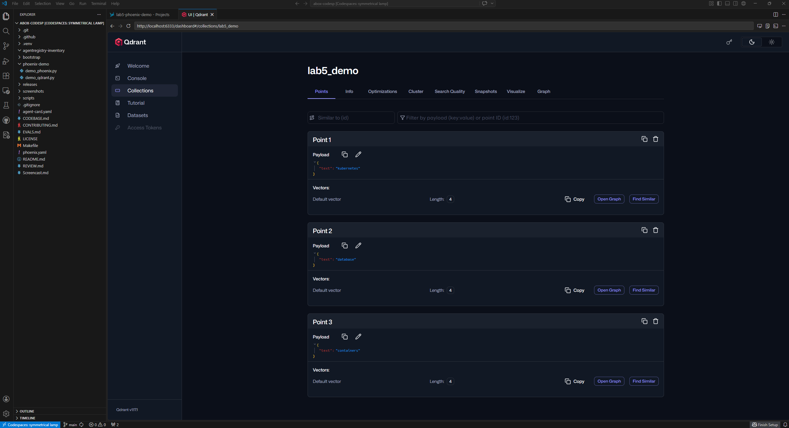

# Phoenix + Qdrant (abox)

## 🔧 Розгортання

Було розгорнуто два сервіси у Kubernetes (abox):

- **Phoenix** — observability для LLM
- **Qdrant** — vector database

Phoenix було розгорнуто як Deployment, Qdrant — через Helm chart.

---

## UI

